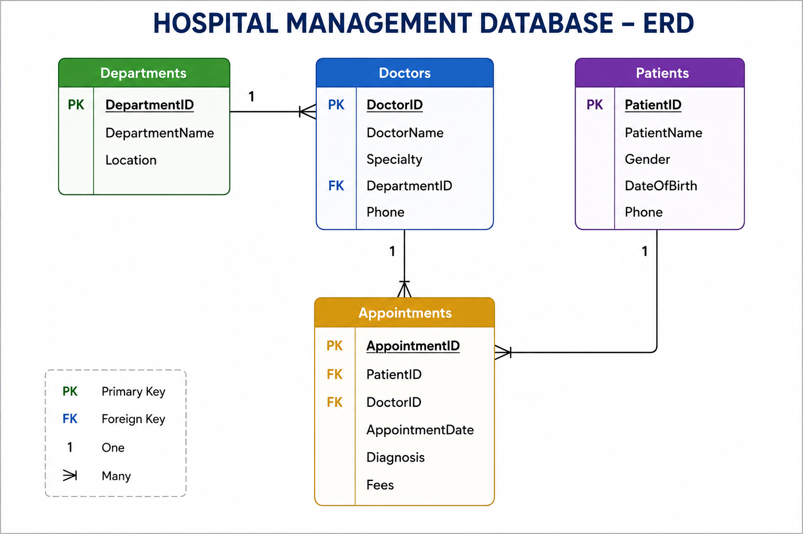

# 🏥 Hospital Management Database

## Project Overview

This project simulates a hospital management system built using SQL Server.

The database manages hospital operations including patients, doctors, departments, and appointments.

---

## Entity Relationship Diagram (ERD)

---

## Database Tables

### Departments
Stores hospital department information.

### Doctors
Contains doctor details and department assignments.

### Patients
Stores patient demographic information.

### Appointments
Tracks appointments between patients and doctors.

---

## Business Questions

- Which doctor handled each appointment?
- Which patients visited specific departments?
- What diagnoses were recorded?
- How much revenue was generated from appointments?

---

## SQL Concepts Used

- Primary Keys
- Foreign Keys
- INNER JOIN
- LEFT JOIN
- Filtering
- Aggregate Functions

---

## Skills Demonstrated

- Database Design
- Relational Data Modeling
- SQL Query Development
- Healthcare Data Analysis

---

## Author

Mohamed Magdy
